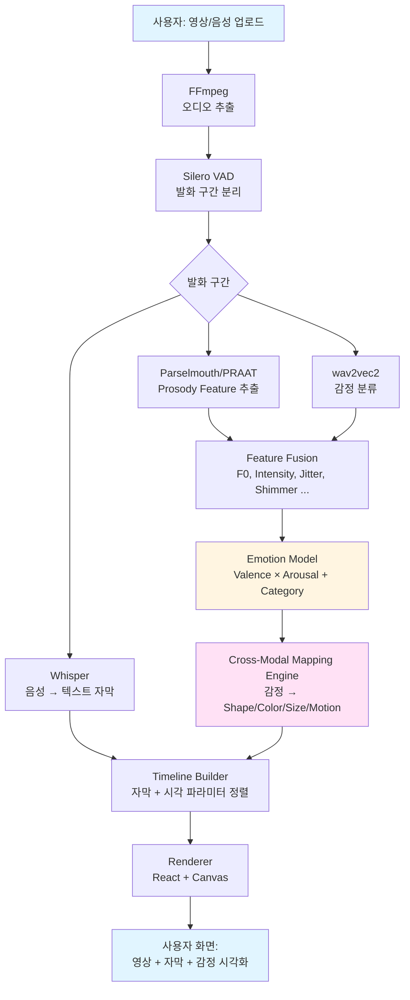
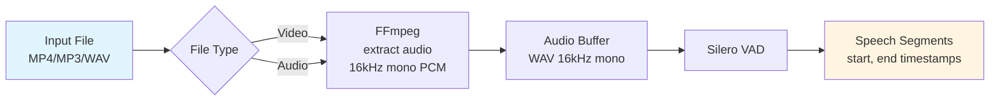
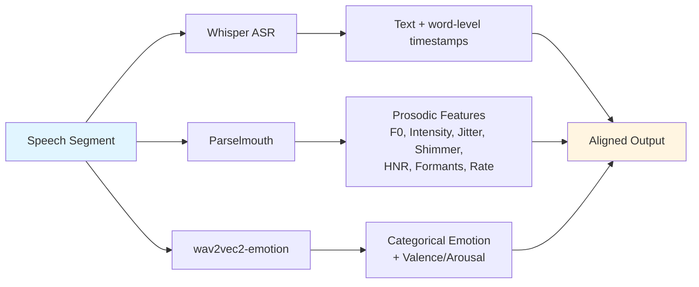
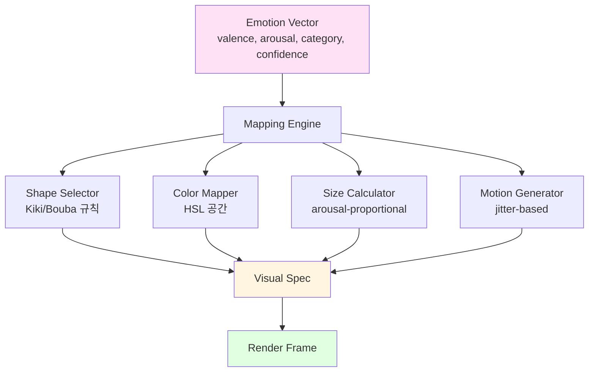
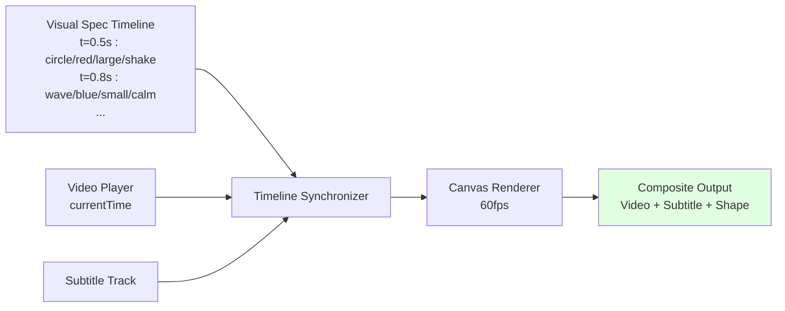
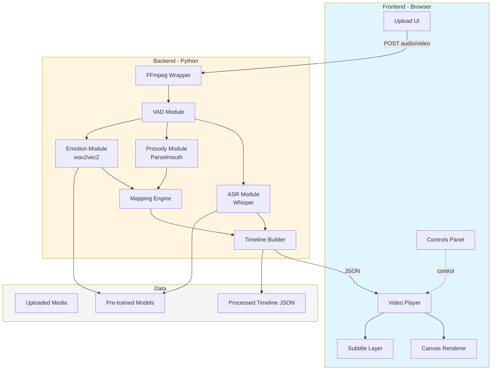
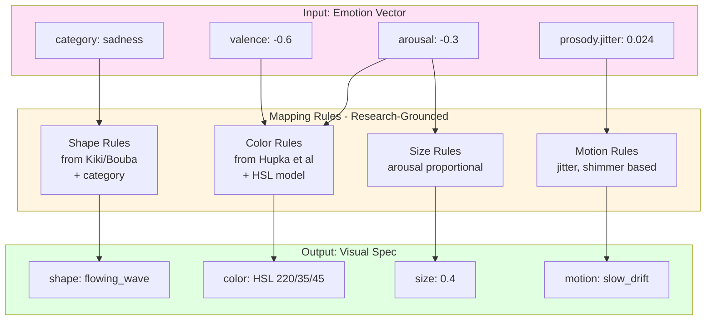

# 03. 시스템 아키텍처

> 데이터가 어디서 들어와 어디로 흘러 무엇으로 나오는가.

---

## 1. 전체 데이터 플로우 (Top-level)



---

## 2. 상세 데이터 파이프라인

### 2.1 입력 처리 단계



### 2.2 병렬 분석 단계



### 2.3 감정 → 시각 매핑 단계 (핵심 차별화)



### 2.4 동기화 & 렌더링 단계



---

## 3. 시스템 컴포넌트 구성



---

## 4. Timeline 데이터 구조 (Backend → Frontend)

백엔드가 처리 후 프론트에 보내는 JSON 구조:

```json
{
  "metadata": {
    "duration": 184.5,
    "sample_rate": 16000,
    "language": "ko"
  },
  "segments": [
    {
      "start": 2.31,
      "end": 4.78,
      "text": "괜찮아... 정말 괜찮아",
      "words": [
        { "word": "괜찮아", "start": 2.31, "end": 2.95 },
        { "word": "정말", "start": 3.45, "end": 3.78 },
        { "word": "괜찮아", "start": 3.81, "end": 4.78 }
      ],
      "prosody": {
        "f0_mean": 142.3,
        "f0_range": 38.7,
        "intensity_mean": 58.2,
        "jitter": 0.024,
        "shimmer": 0.058,
        "speech_rate": 3.2,
        "hnr": 18.4
      },
      "emotion": {
        "category": "sadness",
        "confidence": 0.82,
        "valence": -0.6,
        "arousal": -0.3,
        "secondary": {"melancholy": 0.45, "resignation": 0.31}
      },
      "visual": {
        "shape": "flowing_wave",
        "color": {"h": 220, "s": 35, "l": 45},
        "size": 0.4,
        "motion": {"type": "slow_drift", "amplitude": 0.2}
      }
    }
  ]
}
```

---

## 5. Cross-Modal Mapping의 내부 구조 (확대)



---

## 6. 사용자 시점 화면 구성

```
┌─────────────────────────────────────────────────────────┐
│                                                         │
│                                                         │
│                    [영상 화면]                          │
│                                                         │
│              (드라마 한 장면이 재생됨)                  │
│                                                         │
│                                                         │
│        🌊  "괜찮아... 정말 괜찮아"  🌊                  │
│       (파랑, 작음, 천천히 흔들림)                       │
│                                                         │
│   ⠀⠀⠀⠀⠀⠀⠀⠀⠀⠀⠀⠀⠀⠀⠀⠀⠀⠀⠀⠀⠀⠀⠀⠀⠀⠀⠀⠀⠀⠀⠀ │
│                                                         │
│  [감정 타임라인 (옵션):]                                │
│  ━━━━━━●━━━━━━━━○━━━━━●━━━━━━━━━━━━━━━━━              │
│   슬픔   분노   슬픔                                    │
│                                                         │
└─────────────────────────────────────────────────────────┘
   [▶ 재생]  [자막: ON]  [감정 시각화: ON]  [⚙ 설정]
```

자막 옆/위에 *감정 도형*이 떠 있고, 화면 하단에는 *감정 타임라인*(옵션)으로 영상 전체의 감정 흐름을 볼 수 있다.

---

## 7. 기술 스택 매핑 (다이어그램 ↔ 라이브러리)

| 다이어그램 박스 | 실제 라이브러리/도구 |
|---|---|
| FFmpeg 오디오 추출 | `ffmpeg-python`, `fluent-ffmpeg` |
| Silero VAD | `torch.hub.load('snakers4/silero-vad')` |
| Whisper ASR | `openai-whisper`, `faster-whisper` |
| Parselmouth | `parselmouth` (Python) |
| wav2vec2 감정 | `transformers` (HuggingFace) |
| Mapping Engine | 자체 Python 모듈 (`mapping/`) |
| Timeline Builder | 자체 Python 모듈 |
| Frontend UI | Next.js, React, TailwindCSS |
| Canvas Renderer | HTML5 Canvas API, D3.js |
| Backend API | FastAPI (Python) |

---

## 8. 처리 모드 (Real-time vs Offline)

### Offline Mode (8주 우선 구현)
- 사용자가 파일 업로드 → 백엔드에서 처리 → JSON timeline 반환 → 프론트에서 재생
- 정확도 우선
- *KCF 데모*에 적합

### Real-time Mode (옵션, 시간 남으면)
- 스트리밍 오디오 → 슬라이딩 윈도우 처리 → 실시간 렌더링
- 지연(latency) 200~500ms
- *Chrome extension* (YouTube live caption 위 오버레이) 시나리오

---

## 9. 핵심 설계 원칙

1. **모듈 분리** — VAD, ASR, Prosody, Emotion, Mapping이 각각 독립 모듈. 한 모듈 교체해도 나머지 영향 없음
2. **연구 grounding 유지** — Mapping rules는 *코드 안의 magic number*가 아닌 *문서화된 연구 기반 규칙*. 매핑 변경 시 그 근거가 코드와 문서 양쪽에 기록됨
3. **JSON Timeline을 중간 산출물로** — 백엔드 처리 결과는 항상 JSON으로 저장. 디버깅·시각화·재처리 모두 쉬움
4. **점진적 구현 (vibe coding)** — 처음엔 하드코딩 데이터로 시각화 검증 → 점점 실제 모듈로 교체

---

## 10. 디렉토리 구조 (예정)

```
SoundShape/
├── backend/
│   ├── api/                      # FastAPI 엔드포인트
│   │   └── process.py
│   ├── pipeline/
│   │   ├── audio_io.py           # FFmpeg wrapper
│   │   ├── vad.py                # Silero VAD
│   │   ├── asr.py                # Whisper
│   │   ├── prosody.py            # Parselmouth
│   │   ├── emotion.py            # wav2vec2
│   │   └── timeline.py           # Final builder
│   ├── mapping/
│   │   ├── shape_rules.py
│   │   ├── color_rules.py        # Hupka et al. 기반
│   │   ├── size_rules.py
│   │   ├── motion_rules.py
│   │   └── engine.py             # 통합 엔진
│   ├── models/                   # 사전학습 모델 캐시
│   └── tests/
├── frontend/
│   ├── app/                      # Next.js app router
│   │   ├── page.tsx              # 메인 페이지
│   │   └── api/
│   ├── components/
│   │   ├── VideoPlayer.tsx
│   │   ├── SubtitleLayer.tsx
│   │   ├── EmotionCanvas.tsx     # 핵심 렌더러
│   │   └── EmotionTimeline.tsx
│   ├── lib/
│   │   ├── canvas-shapes.ts      # 도형 그리기 함수
│   │   ├── color-utils.ts
│   │   └── timeline-sync.ts
│   └── styles/
├── data/
│   ├── samples/                  # 테스트용 영상/음성
│   ├── timelines/                # 처리 결과 JSON
│   └── datasets/                 # RAVDESS 등 학습 데이터
├── docs/
│   ├── 00_README.md
│   ├── 01_DIFFERENTIATION.md
│   ├── 02_TECHSTACK.md
│   ├── 03_ARCHITECTURE.md        # 이 문서
│   ├── 04_ROADMAP.md
│   └── mapping_rationale.md      # 매핑 규칙의 학술 근거
├── requirements.txt
├── package.json
└── README.md
```
